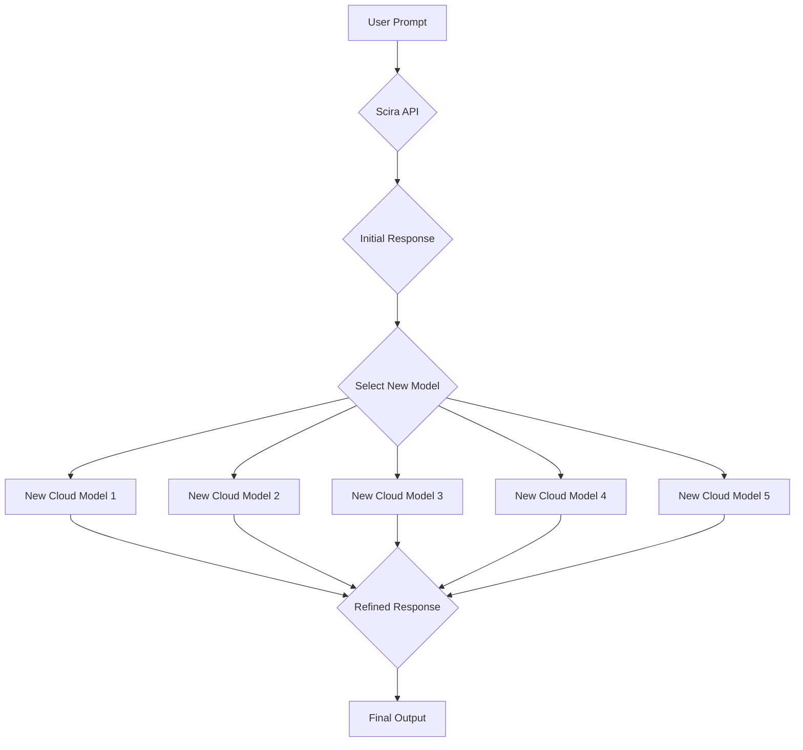
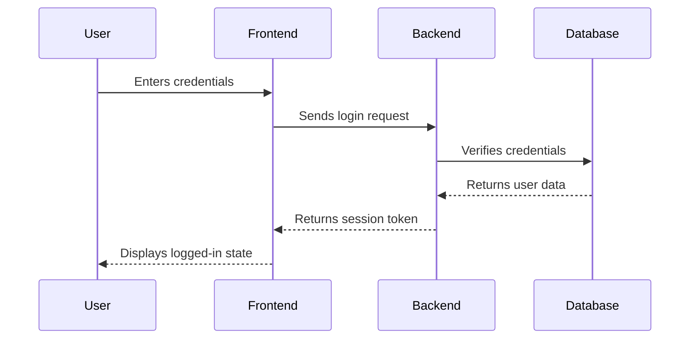
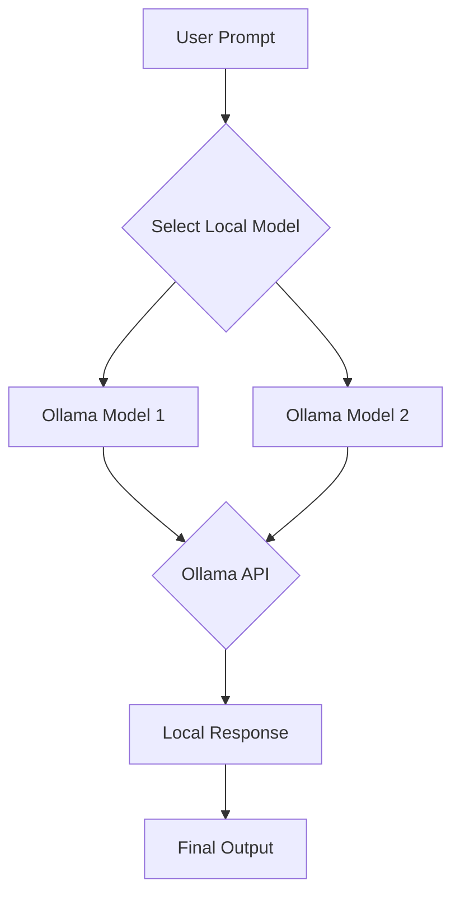

# Project Plan: Deepseek Scira Integration Extension

This document outlines the plan for extending the Deepseek Scira integration with new features as per the requirements.

## 1. Add 5 More Models to Scira Deep Seek Integration

### 1.1. Objective
Integrate five new large language models into the existing application, ensuring they can operate in the "chained" mode similar to the current DeepSeek and Scira integration. This will include both cloud-based and local models.

### 1.2. Plan
1.  **Identify 5 New Models**: Select five models from the Together AI API that are suitable for chained mode. I will prioritize models with different strengths (e.g., coding, reasoning, speed). These will be our cloud-based models.
2.  **Update API Layer**:
    *   Modify the `app/api/ai-chat/route.ts` file to include the new models.
    *   Create a new function, `callGenericTogetherAIModel`, to handle API calls to any of the new models, avoiding code duplication.
    *   Update the `processChainedRequest` function to dynamically select and chain the new models.
3.  **Update Frontend**:
    *   Modify the `app/main/page.tsx` file to add the new models to the model selection dropdown, distinguishing between cloud and local models.
    *   Update the `getModelIcon` and `getModelName` functions to support the new models.

### 1.3. Mermaid Diagram: Chained Model Flow

## 2. Add RBAC/User Authentication and Registration

### 2.1. Objective
Implement a secure user authentication and registration system with Role-Based Access Control (RBAC).

### 2.2. Plan
1.  **Choose Authentication Provider**: I will use a simple, secure, and easy-to-integrate authentication provider. For this project, I'll use NextAuth.js.
2.  **Database Setup**:
    *   I will add a database to store user information, roles, and chat history. I'll use a simple solution like SQLite for local development.
    *   I will create a `database.ts` file to manage the database connection.
3.  **Implement Authentication**:
    *   Add `next-auth` to the project dependencies.
    *   Create a `[...nextauth]/route.ts` file in the `app/api/auth` directory.
    *   Configure NextAuth.js with a credentials provider for email/password authentication.
4.  **Create UI Components**:
    *   Create new pages for user login, registration, and profile management.
    *   Update the main layout to show the user's status (logged in/out).
5.  **Implement RBAC**:
    *   Define user roles (e.g., `user`, `admin`) in the database.
    *   Protect API routes and UI components based on the user's role.

### 2.3. Mermaid Diagram: Authentication Flow

## 3. Add Chat History / Audit Trails and Context

### 3.1. Objective
Persist chat history and provide context for past prompts.

### 3.2. Plan
1.  **Database Schema**:
    *   Create a `chats` table in the database to store chat messages, including the user ID, model used, prompt, response, and timestamp.
2.  **API Layer**:
    *   Modify the `app/api/ai-chat/route.ts` file to save each chat message to the database.
    *   Create a new API route, `app/api/chat-history/route.ts`, to fetch the user's chat history.
3.  **Frontend**:
    *   Update the `app/main/page.tsx` file to fetch and display the user's chat history.
    *   Add a sidebar to the UI to list past chat sessions.

## 4. Add Notifications for New Updates

### 4.1. Objective
Notify users about new updates to the application.

### 4.2. Plan
1.  **Notification System**:
    *   I will use the existing `sonner` and `react-toast` components to display notifications.
2.  **Update Check**:
    *   I will create a simple versioning system. A `version.json` file will be stored on a server (or a mock server for local development).
    *   The application will fetch this file on startup and compare it with the local version. If a new version is available, a notification will be displayed.

## 5. Add File Reading and Upload Capabilities

### 5.1. Objective
Allow users to upload files and use their content as context for prompts.

### 5.2. Plan
1.  **File Upload Component**:
    *   Add a file upload button to the chat input form in `app/main/page.tsx`.
    *   Use a library like `react-dropzone` for a better user experience.
2.  **API Layer**:
    *   Create a new API route, `app/api/upload/route.ts`, to handle file uploads.
    *   The API will parse the file content (e.g., text from a `.txt` or `.md` file) and store it temporarily.
3.  **Prompt Injection**:
    *   The parsed file content will be added to the user's prompt before sending it to the AI model.

## 6. Add Voice Over Capabilities

### 6.1. Objective
Enable voice input to eliminate the need for typing.

### 6.2. Plan
1.  **Web Speech API**:
    *   I will use the browser's built-in Web Speech API for speech recognition.
    *   Add a microphone button to the chat input form.
    *   When the button is clicked, the application will start listening for voice input.
    *   The recognized text will be added to the input field.

## 7. Make Internet Not Accessible

### 7.1. Objective
Prevent the application from accessing the internet, except for the required API endpoints.

### 7.2. Plan
1.  **Content Security Policy (CSP)**:
    *   I will configure a strict Content Security Policy (CSP) in the `next.config.mjs` file.
    *   The CSP will allow connections to `https://api.together.xyz` (for cloud models), `http://localhost:11434` (for local Ollama models), and the application's own origin.
2.  **Offline Mode**:
    *   For the local installable version, I will use a service worker to cache all application assets, allowing it to run offline. The use of local models via Ollama will ensure core functionality remains available without an internet connection.

## 8. Make a Local Installable Version which Should Expire After 5 Days

### 8.1. Objective
Create a local, installable version of the application that expires after 5 days of use.

### 8.2. Plan
1.  **Packaging**:
    *   I will use Electron to package the Next.js application as a desktop app.
2.  **Expiration Logic**:
    *   On the first launch, the application will store the current timestamp in local storage.
    *   On subsequent launches, it will check if 5 days have passed. If so, the application will be disabled.

## 9. Use Brave Browser Headless

### 9.1. Objective
Use the Brave browser in headless mode for the Playwright integration.

### 9.2. Plan
1.  **Update Playwright Configuration**:
    *   Modify the `app/api/ai-chat/route.ts` file to specify the path to the Brave browser executable when launching Playwright.
    *   This will require the user to have Brave browser installed on their system.

## 10. Local Model Integration with Ollama

### 10.1. Objective
Provide the ability to run large language models locally using Ollama, removing the dependency on an internet connection and API keys for those models.

### 10.2. Plan
1.  **User Setup**: The user will be responsible for installing Ollama and downloading the desired local models (e.g., `ollama run llama3`). Documentation will be provided.
2.  **API Layer**:
    *   Create a new function `callOllamaAPI` in `app/api/ai-chat/route.ts` to handle requests to the local Ollama server (typically running on `http://localhost:11434`).
    *   This function will be responsible for sending the prompt to the Ollama API and receiving the response.
3.  **Frontend**:
    *   Update the model selection dropdown in `app/main/page.tsx` to include available Ollama models.
    *   The list of local models can be fetched from the Ollama server or configured manually.
4.  **Health Check**:
    *   Update the `app/api/health/route.ts` to check for the availability of the local Ollama server.

### 10.3. Mermaid Diagram: Local Model Flow

This plan provides a comprehensive roadmap for implementing all the requested features. I will now proceed with the implementation, starting with the first task: adding 5 new models to the Scira Deep Seek integration.